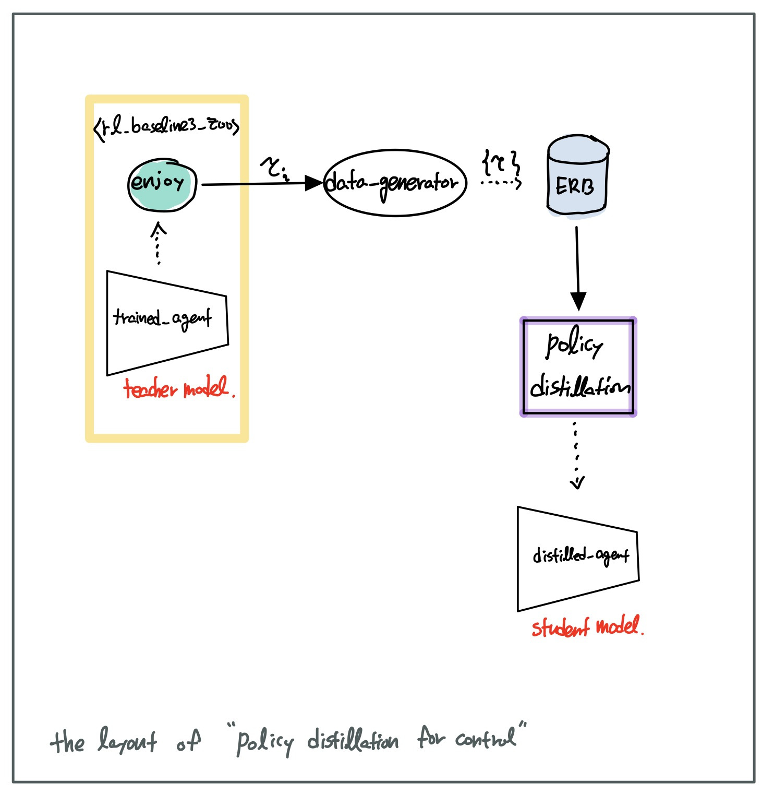

# policy-distillation-for-control

Pytorch Implementation of Policy Distillation


STATUS : [`IN PROGRESS`]()


#### Notice

> *This repository is based on [Mee321/policy-distillation](https://github.com/Mee321/policy-distillation) and integrated with [DLR-RM/rl-baselines3-zoo](https://github.com/DLR-RM/rl-baselines3-zoo) environment.*


### [Basic Concept]




## References

[1] 

```
@misc{rusu2016policy,
      title={Policy Distillation}, 
      author={Andrei A. Rusu and Sergio Gomez Colmenarejo and Caglar Gulcehre and Guillaume Desjardins and James Kirkpatrick and Razvan Pascanu and Volodymyr Mnih and Koray Kavukcuoglu and Raia Hadsell},
      year={2016},
      eprint={1511.06295},
      archivePrefix={arXiv},
      primaryClass={cs.LG}
}
```


[2] [Mee321/policy-distillation](https://github.com/Mee321/policy-distillation)

[3] [DLR-RM/rl-baselines3-zoo](https://github.com/DLR-RM/rl-baselines3-zoo)

[4] [DLR-RM/rl-trained-agents](https://github.com/DLR-RM/rl-trained-agents)

